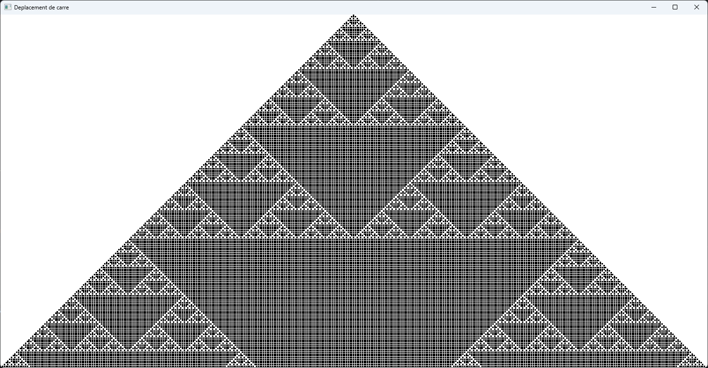

# WolframCellularAutomata

This is a program that simulates a 1D automata. It is based on the Wolfram ruleset.

## Usage
All the code is in the main.cpp file.
You will need to compile it with the SFML library.

## Ruleset
The ruleset is based on the Wolfram ruleset. It is a 1D automata with 3 cells per row. The ruleset is a 8 bit number, so there are 256 possible rulesets. The ruleset is calculated by converting the binary number to decimal.
Here is an example of a ruleset:

000 0\
001 1\
010 1\
011 0\
100 1\
101 0\
110 0\
111 1\
This gives the ruleset 0b01101001 or 105 in decimal.

You can go to [this](https://atlas.wolfram.com/01/01/) website to see all the rulesets.

## Example
Here is an example of a ruleset:
Ruleset 182 or 0b10110110 :\

## License
[MIT](LICENSE)

## Contributing
Pull requests are welcome. For major changes, please open an issue first to discuss what you would like to change.\
If you find any bugs, please open an issue.\
Also if you know how to fix the strange look of the cells, **_PLEASE_** open an issue or directly make a pull request.

## Contact
You can contact me at [my email](mailto:florian.garcia18@gmail.com) or on Discord bouDeScotch
(I should probably get a clean mail tho, so it might change later)

## Acknowledgements
I would like to thank [The Coding Train](https://www.youtube.com/channel/UCvjgXvBlbQiydffZU7m1_aw) for the inspiration and the help.
I did not use any of his code, especially because his is in JavaScript and mine is in C++, but I got the idea from him.